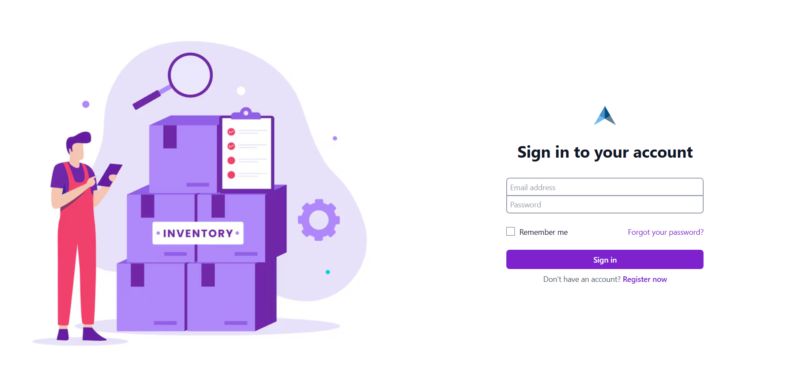
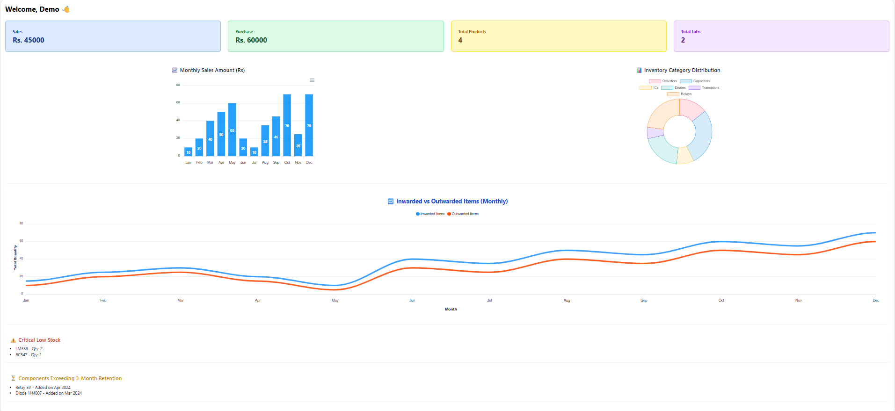
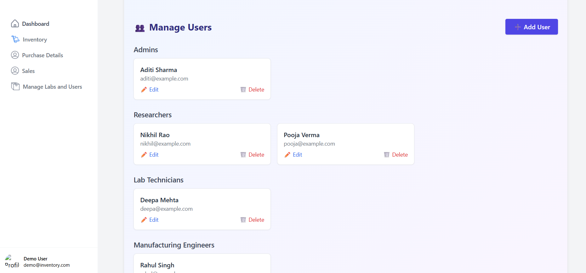

# 🔧 Electronics Lab Inventory Management System

A responsive, full-stack web application to manage components in electronics R\&D and manufacturing laboratories. Designed to streamline stock handling, minimize manual errors, and provide real-time inventory insights.

## 🧹 Problem Statement

Electronics labs deal with a vast variety of components like resistors, ICs, sensors, and connectors. Manual tracking is error-prone, time-consuming, and lacks real-time insights — leading to stockouts, delays, or surplus.

This system enables:

* Efficient tracking of stock movements (inward/outward)
* Component search and categorization
* Low stock & old stock notifications
* Role-based user access
* Visual dashboards with meaningful insights

---

## 🚀 Features

### 👥 Authentication & Access Control

* User registration and login
* Role-based access (Admin, Researcher, Technician, Engineer)
* Secure password management

### 🛆 Component Management

* Add/edit/view/delete components
* Categorize by type, manufacturer, part number, location
* Set critical stock thresholds

### 📈 Dashboard

* Monthly inwards/outwards graph
* Component distribution stats
* Critical stock and idle stock alerts

### 🧲 Stock Movement

* Track inventory movement (Inward / Outward)
* Record date, user, purpose, and quantity
* Purchase and sales logs

### 🔍 Search & Filter

* Filter by category, manufacturer, date range, etc.
* Quick component lookup by keyword

### 🔔 Alerts & Notifications

* Low stock alert when quantity drops below threshold
* Old stock alert if unused >3 months
* In-app popups and visual warnings

---

## 📱 Responsive Design

Accessible across:

* Desktop
* Tablets
* Mobile Devices

Built with a mobile-first approach and tested for real-world use in lab environments.

---

## 🛠️ Tech Stack

| Layer          | Technologies                                                                                   |
| -------------- | ---------------------------------------------------------------------------------------------- |
| **Frontend**   | React.js, TypeScript, Redux Toolkit, Ant Design, Recharts, SweetAlert2, React Router, Tailwind |
| **Backend**    | Node.js, Express.js, MongoDB, Mongoose                                                         |
| **Auth**       | JWT (JSON Web Tokens)                                                                          |
| **Dev Tools**  | GitHub, VSCode, Postman, MongoDB                                                               |

--- 


## 🧪 Sample Workflow

1. **Admin** logs in, creates user roles, sets stock thresholds.
2. **Lab Technician** adds incoming stock for resistors, ICs, etc.
3. **Researcher** searches components (e.g., "4.7 Ohm Resistor") and views availability.
4. **Engineer** logs outward movement for a project.
5. System checks daily for critical/idle stock and alerts the admin.
6. **Admin** reviews dashboard stats for restocking decisions.

---


## 📸 Pages Overview
> Images below demonstrate various features of the app<br>
Login
<p align="center">
  
</p>

Dashboard for normal (Lab Technicians and Manufacturing Engineers)
<p align="center">
  
</p>
Manage Users and Labs(New functionality only for Admin)
<p align="center">
  
</p>
---
 ⚙️ Local Development

### 1. Frontend Setup

```bash
cd frontend
cp .env.example .env
# Set VITE_BASE_URL=http://localhost:8000/api/v1

npm install
npm run dev
```

### 2. Backend Setup

```bash
cd backend
cp .env.example .env
# Fill in:
# NODE_ENV=development
# PORT=8000
# DATABASE_URL=mongodb://localhost:27017/inventory
# JWT_SECRET=your_secret

npm install
npm run dev
```

---

## 📈 Future Enhancements

* Email alerts 
* Barcode scanning for stock tracking
* AI-based demand forecasting
* Native mobile app integration

---
